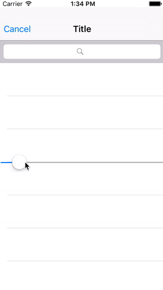
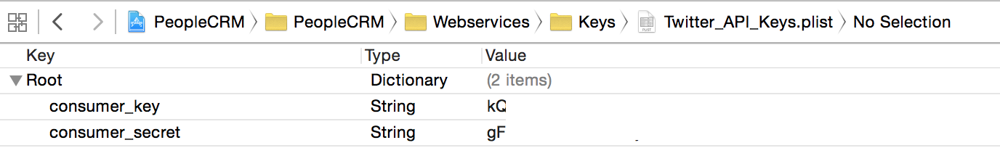

# About this Project

This is a project being built as a proof of concept for the [Swift Flow framework](https://github.com/Swift-Flow/Swift-Flow).

#Demo

This project demonstrates some of the capabilites of the Swift Flow framework, including recording and replaying of application state:



##Setup

###Carthage

To install the dependencies run:

```
carthage update --no-use-binaries
```

This project currently doesn't use Carthage binaries [due to this issue with them](https://github.com/Carthage/Carthage/issues/924).
	
###Twitter Authentication

If you want to run this app you will need to create an app on [apps.twitter.com](https://apps.twitter.com) since this application requires to authenticate with Twitter.

Once you have created an app you need to create a `.plist` file called `TwitterKeys.plist` and add it to the project.

Finally, you need to fill the plist with the `consumer_key` and `consumer_secret` provided by twitter:



